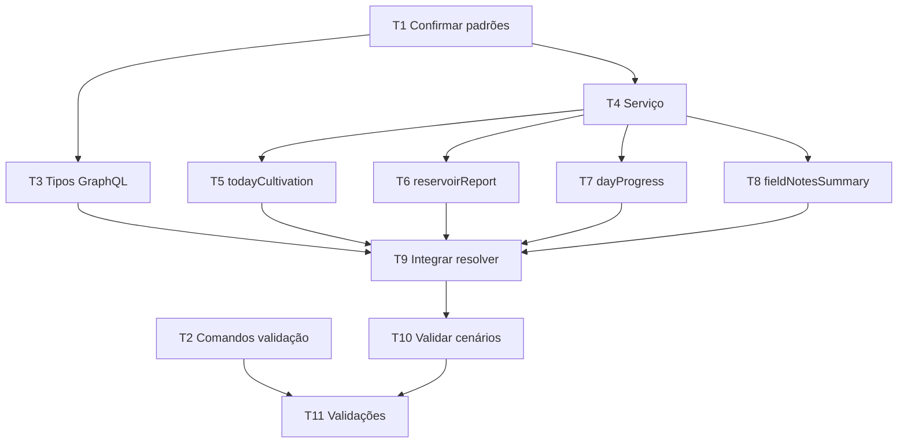

# Tasks: `home-info-context-api`

- **Repo:** `isis`
- **Path:** `.specs/features/home-info-context-api/tasks.md`
- **Status:** Proposto
- **Última atualização:** 2026-07-02

---

## 1) Contexto: por que estas tarefas existem

A feature adiciona o bloco `infoContext` à query `homeDashboard(contaId)` sem alterar schema de banco. As tarefas abaixo quebram o trabalho em passos pequenos, verificáveis e com dependências explícitas, priorizando baixo acoplamento ao arquivo monolítico `src/schemas/query.js` e evitando N+1.

---

## 2) Goals e Non-Goals

### Goals

1. Implementar contrato GraphQL documentado em `spec.md`.
2. Isolar cálculo em serviço dedicado ou extração equivalente.
3. Validar agregações de Agenda, Reservatorio, Lote, SNutritiva, Atividade, Lotes_Atividades e Usuario.
4. Garantir defaults seguros para ausência de dados.
5. Executar validações existentes do projeto.

### Non-Goals

1. Implementar nesta etapa de especificação.
2. Alterar schema Prisma ou criar migration.
3. Refatorar integralmente `homeDashboard`.
4. Criar contrato de duração/tempo gasto de tarefa.

---

## 3) Tarefas verificáveis

### T1 — Confirmar padrões existentes de schema e resolver

- **Tipo:** análise
- **Pode rodar em paralelo:** sim, com T2
- **Dependências:** nenhuma
- **Arquivos esperados:** leitura de `src/schemas/homeDashboard.js`, `src/schemas/query.js`, padrões de serviços existentes se houver.
- **Passos:**
  1. Identificar como tipos Nexus são exportados em `homeDashboard.js`.
  2. Identificar como `homeDashboard(contaId)` monta seu payload atual.
  3. Identificar padrão existente para services em `src/services/`.
- **Verificação:** anotar no plano de implementação quais arquivos serão tocados e qual responsabilidade terá cada um.

### T2 — Confirmar comandos de validação do projeto

- **Tipo:** análise
- **Pode rodar em paralelo:** sim, com T1
- **Dependências:** nenhuma
- **Arquivos esperados:** `package.json`, configuração de lint/test/build se existir.
- **Passos:**
  1. Ler scripts disponíveis.
  2. Selecionar comandos de validação mínimos.
- **Verificação:** lista objetiva de comandos a executar ao final.

### T3 — Adicionar tipos GraphQL/Nexus de `infoContext`

- **Tipo:** implementação
- **Pode rodar em paralelo:** não
- **Dependências:** T1
- **Arquivos esperados:** `src/schemas/homeDashboard.js`
- **Passos:**
  1. Adicionar `HomeInfoContext`.
  2. Adicionar `HomeTodayCultivationInfo`.
  3. Adicionar `HomeReservoirReport`.
  4. Adicionar `HomeReservoirSummary`.
  5. Adicionar `HomeDayProgress`.
  6. Adicionar `HomeFieldNotesSummary`.
  7. Adicionar `HomeFieldNoteSummary`.
  8. Adicionar `HomeInfoTask`.
  9. Adicionar `HomeInfoAlert`.
- **Verificação:** schema GraphQL gerado/validado sem erro e tipos aparecem no contrato introspectável, se houver geração local.

### T4 — Criar serviço de composição de `HomeInfoContext`

- **Tipo:** implementação
- **Pode rodar em paralelo:** não
- **Dependências:** T1
- **Arquivos esperados:** `src/services/homeInfoContextService.js` ou extração equivalente conforme padrão existente.
- **Passos:**
  1. Criar função de build do `infoContext` recebendo `contaId`, contexto Prisma e data de referência.
  2. Definir helpers internos para defaults vazios.
  3. Definir transformação de `Agenda` para `HomeInfoTask`.
  4. Definir transformação de alertas para `HomeInfoAlert`.
- **Verificação:** serviço pode retornar objeto completo com dados vazios sem lançar erro.

### T5 — Implementar `todayCultivation`

- **Tipo:** implementação
- **Pode rodar em paralelo:** não
- **Dependências:** T4
- **Arquivos esperados:** serviço de `infoContext`; integração mínima no resolver se reaproveitar dados existentes.
- **Passos:**
  1. Reaproveitar dados já calculados pela Home atual quando disponíveis.
  2. Consultar/completar tarefas de hoje via `Agenda` quando necessário.
  3. Calcular atrasadas por `Agenda.data` anterior ao dia e `finalizado = false`.
  4. Contar lotes ativos por `Lote.ativo = true` e `deleted_at = null`.
  5. Mapear colheitas próximas e alertas conforme regra existente ou fallback documentado.
- **Verificação:** payload bate com dados já existentes da Home para os mesmos cenários.

### T6 — Implementar `reservoirReport`

- **Tipo:** implementação
- **Pode rodar em paralelo:** pode rodar em paralelo com T7 depois de T4
- **Dependências:** T4
- **Arquivos esperados:** serviço de `infoContext`.
- **Passos:**
  1. Buscar reservatórios por `fk_contas_id = contaId` e `deleted_at = null`.
  2. Incluir ou agregar solução nutritiva (`SNutritiva.nome`, `SNutritiva.c_eletrica`).
  3. Contar reservatórios com/sem solução.
  4. Somar `volume`, tratando `null` como zero.
  5. Contar lotes ativos vinculados.
  6. Montar `highlightedReservoirs` sem query por reservatório.
- **Verificação:** totais conferem em cenário com reservatórios com solução, sem solução e sem reservatórios.

### T7 — Implementar `dayProgress`

- **Tipo:** implementação
- **Pode rodar em paralelo:** pode rodar em paralelo com T6 depois de T4
- **Dependências:** T4
- **Arquivos esperados:** serviço de `infoContext`.
- **Passos:**
  1. Buscar agendas do dia com `deleted_at = null`.
  2. Contar total, finalizadas e pendentes por `finalizado`.
  3. Buscar/contar atrasadas não finalizadas.
  4. Selecionar próxima pendente por `Agenda.data` asc.
  5. Gerar `completionLabel` sem mencionar tempo ou duração.
- **Verificação:** contas diferenciam finalizadas/pendentes e não retornam duração.

### T8 — Implementar `fieldNotesSummary`

- **Tipo:** implementação
- **Pode rodar em paralelo:** pode rodar em paralelo com T6/T7 depois de T4
- **Dependências:** T4
- **Arquivos esperados:** serviço de `infoContext`.
- **Passos:**
  1. Consultar `Lotes_Atividades` por `fk_contas_id = contaId`.
  2. Incluir `Atividade`, `Lote` e `Usuario` com seleção mínima.
  3. Ordenar por `Atividade.created_at` desc.
  4. Limitar `latestNotes` a 5.
  5. Retornar por vínculo lote-atividade.
- **Verificação:** últimas notas preservam lote e usuário quando disponíveis; sem N+1.

### T9 — Integrar serviço em `homeDashboard(contaId)`

- **Tipo:** implementação
- **Pode rodar em paralelo:** não
- **Dependências:** T3, T5, T6, T7, T8
- **Arquivos esperados:** `src/schemas/query.js`
- **Passos:**
  1. Importar/chamar serviço dedicado.
  2. Passar `contaId`, contexto Prisma e dados existentes reaproveitáveis.
  3. Incluir `infoContext` no objeto retornado pela query.
  4. Manter alteração mínima no resolver.
- **Verificação:** query `homeDashboard(contaId)` retorna `infoContext` quando selecionado.

### T10 — Validar contrato e cenários vazios

- **Tipo:** validação
- **Pode rodar em paralelo:** não
- **Dependências:** T9
- **Passos:**
  1. Executar query manual/local com conta sem dados.
  2. Executar query manual/local com dados de Agenda.
  3. Executar query manual/local com reservatórios com/sem solução.
  4. Executar query manual/local com atividades vinculadas a lotes.
- **Verificação:** critérios de aceite de `spec.md` atendidos.

### T11 — Rodar validações automatizadas existentes

- **Tipo:** validação
- **Pode rodar em paralelo:** não
- **Dependências:** T10 e comandos identificados em T2
- **Comandos candidatos:**
  - `npm test` ou script equivalente, se existir.
  - `npm run lint`, se existir.
  - `npm run build`, se existir.
  - comando de geração/validação de schema GraphQL, se existir.
- **Verificação:** todos os comandos aplicáveis passam ou falhas são documentadas com causa.

---

## 4) Dependências e paralelização

Paralelização segura:

- T1 e T2 podem rodar em paralelo.
- Após T4, T6, T7 e T8 podem ser implementadas em paralelo se não houver conflito no mesmo arquivo; caso o serviço seja um único arquivo, coordenar alterações para evitar conflitos.
- T9, T10 e T11 são sequenciais.

---

## 5) Acceptance criteria das tarefas

1. T3 concluída somente se todos os tipos obrigatórios estiverem definidos no schema.
2. T4 concluída somente se o serviço retornar shape completo com defaults.
3. T6/T8 concluídas somente se não houver query por item para relações principais.
4. T9 concluída somente se `homeDashboard(contaId)` retornar `infoContext` sem alterar comportamento de campos existentes.
5. T10 concluída somente se cenários vazios retornarem arrays vazios/zeros/nullables corretos.
6. T11 concluída somente após execução dos comandos existentes aplicáveis ou documentação explícita da ausência deles.

---

## 6) Open questions que precisam de clarificação

1. Quais scripts reais de validação o projeto possui no `package.json`?
2. Existe ambiente local com dados suficientes para validar reservatórios, agendas e anotações manualmente?
3. A implementação deve adicionar testes automatizados se houver padrão existente para resolvers GraphQL?
4. Qual limite final de `highlightedReservoirs` deve ser adotado?
5. Qual timezone deve guiar “hoje” nas consultas por `Agenda.data`?
