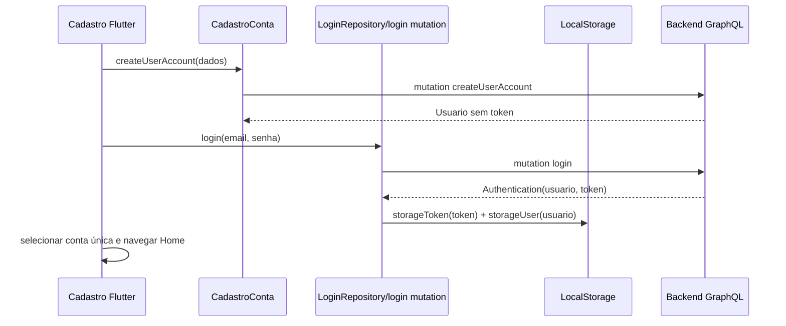
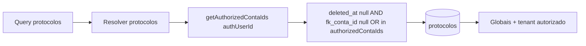

# Design: Onboarding autenticado e protocolos globais/tenant-scoped

## Contexto

A correção cruza duas aplicações: frontend Flutter (`osi-solucoes`) e backend GraphQL (`isis`). O problema raiz tem duas partes independentes, mas percebidas no mesmo onboarding: ausência de token após cadastro e inconsistência de escopo/visibilidade de protocolos seed globais.

Arquivos observados durante exploração:

- Frontend cadastro: `osi-solucoes/lib/features/data/datasources/cadastro/cadastro_datasource.dart`
- Frontend login/persistência: `osi-solucoes/lib/features/presenter/viewmodels/login_store.dart`, `osi-solucoes/lib/core/services/local_storage.dart`, `osi-solucoes/lib/features/data/datasources/login/login_datasource.dart`
- Frontend protocolos: `osi-solucoes/lib/features/data/datasources/protocolo/protocolo_datasource.dart`, `osi-solucoes/lib/features/presenter/viewmodels/protocolo_store.dart`
- Backend protocolos/sNutritivas: `isis/src/schemas/query.js`
- Backend seed protocolos: `isis/prisma/seed.js`
- Backend schema: `isis/prisma/schema.prisma`

## Objetivos e não objetivos

### Objetivos

- Garantir que a entrada na Home após cadastro ocorra somente após autenticação real com token persistido.
- Tornar protocolos globais visíveis para usuários autenticados.
- Escopar protocolos no backend por contas autorizadas + globais.
- Evitar alteração de contrato de `createUserAccount`.
- Preservar escopo atual de soluções nutritivas.

### Não objetivos

- Não implementar novo endpoint/mutation de cadastro autenticado.
- Não alterar estrutura de tabelas.
- Não mudar seed de soluções nutritivas nesta feature.
- Não permitir edição direta de protocolo global por qualquer tenant.

## Abordagem técnica e decisões de design

### 1. Frontend: cadastro deve encadear login existente

Após sucesso de `createUserAccount`, o fluxo de apresentação deve chamar a autenticação existente com o mesmo email/senha informados no formulário. A mutation `login` já retorna `Authentication` com `usuario` e `token`, e `LoginStore.login()` já persiste token e usuário via `LocalStorage`.

Decisão: reutilizar a mutation `login` em vez de modificar `createUserAccount`.

Motivos:

- Menor mudança de contrato GraphQL.
- Centraliza a regra de emissão/persistência de token no fluxo já existente.
- Reduz risco para clientes que já usam `createUserAccount`.

Ponto de atenção: se `LoginStore.login()` estiver acoplado a `TextEditingController`, a implementação pode optar por extrair/reutilizar uma camada de repositório/serviço de autenticação por credenciais, mantendo o comportamento de persistência consistente.

### 2. Backend: escopo explícito para protocolos

Substituir o uso genérico de `withActiveFilter(true)` em `t.crud.protocolos` por resolver que injete escopo:

```text
deleted_at = null AND (fk_conta_id IS NULL OR fk_conta_id IN authorizedContaIds)
```

Para query singular `protocolo`, o resolver deve permitir retorno somente se:

- o protocolo não está deletado; e
- `fk_conta_id` é `null`; ou
- `fk_conta_id` pertence às contas autorizadas do usuário autenticado.

Usuário sem autenticação não deve obter protocolos via esse caminho, pois globais são definidos como visíveis a todo usuário autenticado, não públicos anônimos.

### 3. Frontend: query de protocolos deve incluir globais

A query atual filtra por `conta.id.equals = contaId`, excluindo `fk_conta_id = null`. Ela deve ser ajustada para receber globais e conta atual. Há duas opções compatíveis:

- **Recomendada:** o cliente envia filtro `OR` com conta atual ou `conta: null`, mantendo clareza de intenção e compatibilidade com backend escopado.
- **Alternativa:** o cliente remove filtro de conta e confia totalmente no backend para retornar globais + autorizados.

Mesmo com filtro frontend, o backend deve ser a autoridade de isolamento tenant.

### 4. Soluções nutritivas permanecem como estão

`sNutritivas` já usa `getAuthorizedContaIds(ctx.prisma, ctx.authUserId)` e `buildSolucaoTenantScopeWhere(authorizedContaIds)`. A feature não deve mudar seed ou escopo, apenas garantir que o token exista no pós-cadastro para que `authUserId` esteja disponível.

## Estruturas de dados e interfaces envolvidas

### Frontend

- `Usuario`: modelo persistido em `LocalStorage.storageUser`.
- `Authentication`: retorno esperado da mutation `login`, contendo `usuario` e `token`.
- `LocalStorage`:
  - `storageToken(String value)`
  - `getToken()`
  - `storageUser(Usuario user)`
- `CadastroConta.cadastraConta(...)`: continua retornando `Either<Failure, Usuario>`.
- `LoginRepository.login({email, codigo, senha})`: deve ser reutilizado para pós-cadastro por email/senha.
- `ProtocoloDatasource.buscarProtocolos(int contaId)`: deve passar a buscar globais + conta.

### Backend

- `getAuthorizedContaIds(prisma, authUserId)`: base para escopo tenant.
- `Protocolo.fk_conta_id`: `null` indica global; inteiro indica tenant proprietário.
- `deleted_at`: filtro obrigatório para ocultar removidos.
- Query GraphQL `protocolos`: lista protocolos ativos visíveis ao usuário autenticado.
- Query GraphQL `protocolo`: retorna protocolo ativo visível ou bloqueia/oculta protocolo fora de escopo.

## Arquitetura proposta





## Arquivos prováveis para implementação futura

### Frontend `osi-solucoes`

- `lib/features/presenter/viewmodels/cadastro_store.dart`
- `lib/features/data/repositories/login/login_repository.dart` ou criação de método de autenticação reutilizável se necessário
- `lib/features/data/datasources/protocolo/protocolo_datasource.dart`
- `lib/features/presenter/viewmodels/login_store.dart` se a persistência precisar ser extraída/reutilizada

### Backend `isis`

- `src/schemas/query.js`
- Possíveis testes existentes de GraphQL, se houver no projeto

## Riscos e mitigação

- **Risco:** reutilizar `LoginStore.login()` diretamente pode acoplar cadastro a controllers de tela. **Mitigação:** preferir método de serviço/repositório com parâmetros explícitos se a extração for pequena.
- **Risco:** backend `t.crud.protocolos` com filtros arbitrários pode combinar `args.where` de forma insegura. **Mitigação:** sempre envolver filtros do cliente com `AND` + escopo servidor.
- **Risco:** retornar erro para protocolo singular fora de escopo pode quebrar UI que espera `null`. **Mitigação:** decidir comportamento antes da implementação; recomendação inicial é erro tipado para violação de tenant ou `null` para preservar semântica de not found.
- **Risco:** protocolos globais com ações/fases podem ter `fk_conta_id = null`; telas que assumem `conta.id` podem quebrar. **Mitigação:** validar parsing do modelo e telas de listagem/detalhe com protocolo global.
- **Risco:** login pós-cadastro falha por normalização de email/senha divergente. **Mitigação:** usar exatamente credenciais informadas no formulário e tratar falha bloqueando navegação autenticada.

## Validação técnica planejada

- Executar fluxo manual de cadastro em ambiente local/homologação e confirmar token persistido antes da Home.
- Consultar `protocolos` autenticado com usuário de conta A e confirmar ausência de protocolos da conta B.
- Consultar `protocolos` autenticado e confirmar presença de registros com `fk_conta_id = null`.
- Consultar `sNutritivas` após cadastro e confirmar que retorna dados apenas se vinculados por `solucoes_contas` autorizada.
- Rodar comandos existentes de lint/typecheck/test/build identificáveis nos dois projetos antes de concluir implementação futura.

## Questões em aberto

- Qual comportamento de erro deve ser padronizado para `protocolo(id)` fora de escopo: `null`, `NOT_FOUND` ou `TENANT_SCOPE_VIOLATION`?
- Deve haver indicação visual no frontend de que protocolos globais são templates/sistema?
- Usuários podem editar protocolos globais diretamente ou a edição deve criar cópia tenant-specific?
